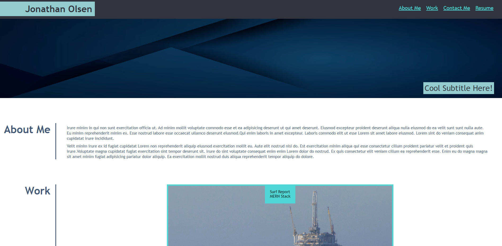

# Portfolio

## Description
This project is designed to showcase the abilty to manipulate html elements through the use of Cascading Style Sheets (CSS). It combines to completely customized files. The HTML file sets up the structure for the document, and the CSS file adds stylizing elements to it. During the process of developing this, I ran into many issues. Learning how to set up a grid system proved to be quite the challenge. In order to fully understand what was going on, I used the inspection tools on the Chrome web browser. This allowed me to see what properties were being applied to the elements and which ones were not.


## User Story

```
AS AN employer
I WANT to view a potential employee's deployed portfolio of work samples
SO THAT I can review samples of their work and assess whether they're a good candidate for an open position
```


## Acceptance Criteria

Here are the critical requirements necessary to develop a portfolio that satisfies a typical hiring manager’s needs:

```
GIVEN I need to sample a potential employee's previous work
WHEN I load their portfolio
THEN I am presented with the developer's name, a recent photo or avatar, and links to sections about them, their work, and how to contact them
WHEN I click one of the links in the navigation
THEN the UI scrolls to the corresponding section
WHEN I click on the link to the section about their work
THEN the UI scrolls to a section with titled images of the developer's applications
WHEN I am presented with the developer's first application
THEN that application's image should be larger in size than the others
WHEN I click on the images of the applications
THEN I am taken to that deployed application
WHEN I resize the page or view the site on various screens and devices
THEN I am presented with a responsive layout that adapts to my viewport
```


## Usage

The functionality of this single page application are as follows:

- Load the webpage
- Use the nav bar elements to take you to each section of the application
- Clicking on the different projects will function as a link to the projects actual location

## Screenshot 



## Author
Follow me on GitHub at [Jonathan Olsen](https://github.com/jonathanjjolsen)!